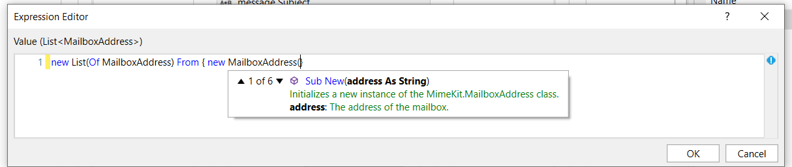

[TOC]

### Enviar Correo HTML con UiPath desde un servidor SMTP

Este documento describe el funcionamiento del workflow para enviar correos electrónicos con formato HTML e imágenes incrustadas usando un servidor SMTP(*)

#### Funcionamiento

El funcionamiento es básicamente tomar el contenido de una carpeta la cual *debe* tener un archivo HTML que será el contenido del correo y las imágenes en dicha carpeta referenciadas dentro del archivo HTML. En pocas palabras, se debe tener armado el correo con las imagenes en HTML de la manera convencional como ser suele hacerse cuando se escribe una página HTML.

Una vez se lee este contenido HTML, el workflow tomará las imágenes y transformará el código HTML de modo que sea interpretado correctamente como un correo tipo MIME adecuado. Posteriormente el Workflow creará el contenido debidamente formateado para ser enviado por SMTP de la manera convencional. 

La diferencia es que dicho contenido contiene los headers y estructura que permitira que los clientes de correo (como outlook) lo interpreten correctamente. Los pasos hechos por el robot están basados en la libreria "Mailkit - Mimekit" la cual se encuentra documentada en http://www.mimekit.net/ 

#### Argumentos

| Argumento                 | Descripción                                                  | Valor por default / Comentarios                              |
| ------------------------- | ------------------------------------------------------------ | ------------------------------------------------------------ |
| in_ContentEmailFolderPath | Entrada - Una cadena de texto que indica el path donde se aloja la carpeta con el contenido del correo (HTML + imágenes) | "emailcontent"                                               |
| in_EmailHostname          | Entrada - Una cadena de texto que indica el nombre del servidor SMTP | "localhost"                                                  |
| in_EmailPort              | Entrada - El numero del puerto                               | 25                                                           |
| in_EmailUseSSL            | Entrada - Booleano que indica si el proceso requiere Uso de conexión Segura SSL | Por defecto es False, aunque el workflow establecerá este valor al momento de realizar la conexión automáticamente |
| in_LoginUsername          | Entrada - Cadena de texto que indica el usuario de autenticación al servidor SMTP | Dejar en blanco si el Servidor SMTP no requiere autenticación |
| in_LoginPassword          | Entrada - Cadena de texto que indica la contraseña de autenticación al servidor SMTP | Dejar en blanco si el Servidor SMTP no requiere autenticación |
| in_ListOfRecipients       | Entrada - Es una lista de tipo **System.Collections.Generic.List<MimeKit.MailboxAddress>** la cual describe la lista de correos electrónicos de los destinatarios a enviar el correo. Agregar tantas direcciones somo sea necesario.  **Ejemplo de Uso**  `new List(Of MailboxAddress) From { new MailboxAddress("Nombre Destinatario 1","destinatario1@ejemplo.com"),new MailboxAddress("Nombre Destinatario 2", "destinatario2@ejemplo.com"), new MailboxAddress("destinatario3@ejemplo.com")}` | Por defecto es una Lista Vacia  `new List(Of MailboxAddress)` |
| in_ListOfSenders          | Entrada - Es una lista de tipo **System.Collections.Generic.List<MimeKit.MailboxAddress>** la cual describe la lista de correos electrónicos de los remitentes que envían el correo.   **ALERTA: Algunos Clientes NO Soportan la característica de envio de correo por más de un remitente. Si este es el caso, solo indique Un(1) elemento en la lista**  **Ejemplo de Uso**  `new List(Of MailboxAddress) From { new MailboxAddress("Nombre Remitente","remitente@ejemplo.com")}` | Por defecto es una Lista Vacia  `new List(Of MailboxAddress)` |
| in_CCAddresses            | Entrada - Es una lista de tipo **System.Collections.Generic.List<MimeKit.MailboxAddress>** la cual describe la lista de correos electrónicos de los destinatarios **En Copia (CC)** a quienes se les envía el correo. Agregar tantas direcciones somo sea necesario.  **Ejemplo de Uso**  `new List(Of MailboxAddress) From { new MailboxAddress("Nombre Destinatario 1","destinatario1@ejemplo.com"),new MailboxAddress("Nombre Destinatario 2", "destinatario2@ejemplo.com"), new MailboxAddress("destinatario3@ejemplo.com")}` | Por defecto es una Lista Vacia  `new List(Of MailboxAddress)` |
| in_BCCAddresses           | Entrada - Es una lista de tipo **System.Collections.Generic.List<MimeKit.MailboxAddress>** la cual describe la lista de correos electrónicos de los destinatarios **En Copia Oculta (BCC)** a quienes se les envía el correo. Agregar tantas direcciones somo sea necesario.  **Ejemplo de Uso**  `new List(Of MailboxAddress) From { new MailboxAddress("Nombre Destinatario 1","destinatario1@ejemplo.com"),new MailboxAddress("Nombre Destinatario 2", "destinatario2@ejemplo.com"), new MailboxAddress("destinatario3@ejemplo.com")}` | Por defecto es una Lista Vacia  `new List(Of MailboxAddress)` |
| in_ReplyToAddresses       | Entrada - Es una lista de tipo **System.Collections.Generic.List<MimeKit.MailboxAddress>** la cual describe la lista de correos electrónicos A quienes se desea enviar la respuesta si dicha respuesta no va dirigida al remitente o remitentes. Esta Caracteristica se usa por ejemplo, si el Remitente no es una direccion de correo real, pero se desea redirigir la respuesta a una dirección válida.   **ALERTA: Algunos Clientes NO Soportan la característica de Respuesta de correo por más de un remitente. Si este es el caso, solo indique Un(1) elemento en la lista**  **Ejemplo de Uso**  `new List(Of MailboxAddress) From { new MailboxAddress("Nombre Remitente","remitente@ejemplo.com")}` | Por defecto es una Lista Vacia  `new List(Of MailboxAddress)` |
| in_Subject                | Entrada - Cadena de Texto que indica el Asunto del Correo    | Vacio                                                        |

*Imagen: La forma en que se describen las listas en algunos de los argumentos del workflow*

*Imagen: en algunos casos es posible sólo indicar la dirección de Correo electrónico sin un nombre.*

#### Consideraciones

**IMPORTANTE**: Importar Los namespaces antes de iniciar:

* MailKit
* MimeKit

**Sobre el Diseño** 

Es importante anotar que el diseño y correcta visualización del correo con imágenes incrustadas depende en gran medida de la estructura y el estilo del contenido HTML, la cual está a discreción del Desarrollador. Se requiere investigar más en detalles las técnicas para crear correos que se vean adecuadamente en todos los clientes de correo sin alteraciones mayores. 

(*) Los correos HTML con imágenes incrustadas tienen limitaciones al momento de ser renderizados por el cliente de correo. Esto implica que ciertos estilos, elementos HTML, imágenes o scripts Javascript no sean interpretados correctamente. Revise que el contenido del correo sea el adecuado y que pueda visualizarse correctamente en el cliente de correo.

#### Posibles Mejoras

- Es bueno implementar una "vista plana", es decir, una versión en texto plano del contenido del correo para clientes que no soporten la característica de correos HTML. Esto es recomendado realizar para que los clientes de correo puedan mostrar el contenido si por alguna razón las directivas de seguridad impiden la descarga de contenido multimedia en los correos (Fuentes, imágenes, estilos CSS, etc) 
  
- Aunque el workflow determinará dinámicamente la forma de realizar la conexión segura, en algunos casos puede ser necesario indicar explícitamente el uso de SSL/TLS y los puertos específicos. Remitirse a la documentacion de la libreria Mailkit - Mimekit para más detalles.
  
- Para facilitar las pruebas, se recomienda usar https://github.com/ChangemakerStudios/Papercut-SMTP el cual es un programa que actua como servidor SMTP y visor de correos. 